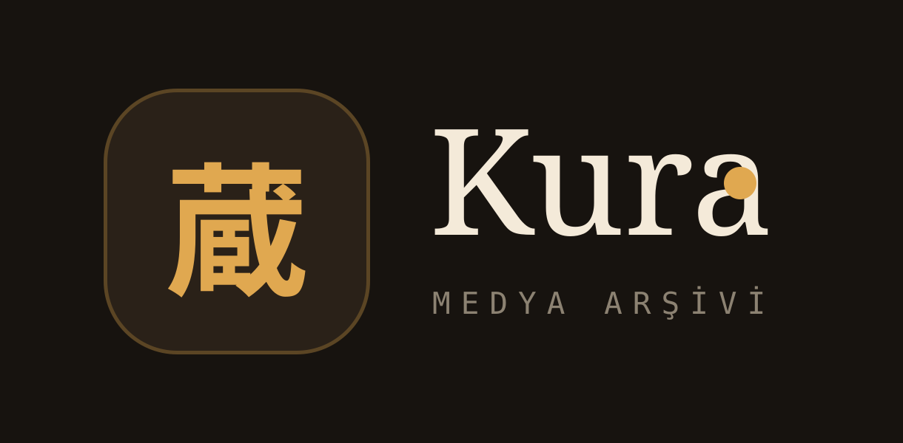
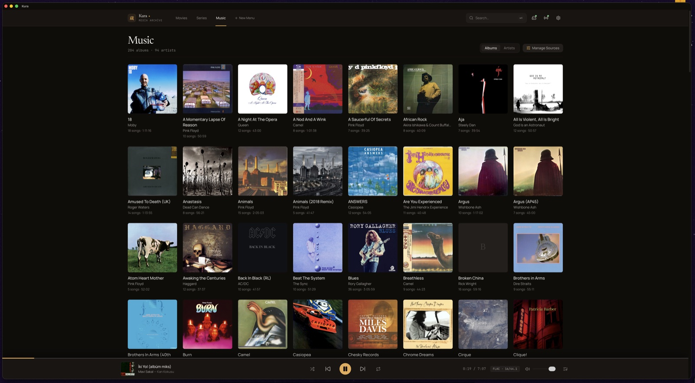
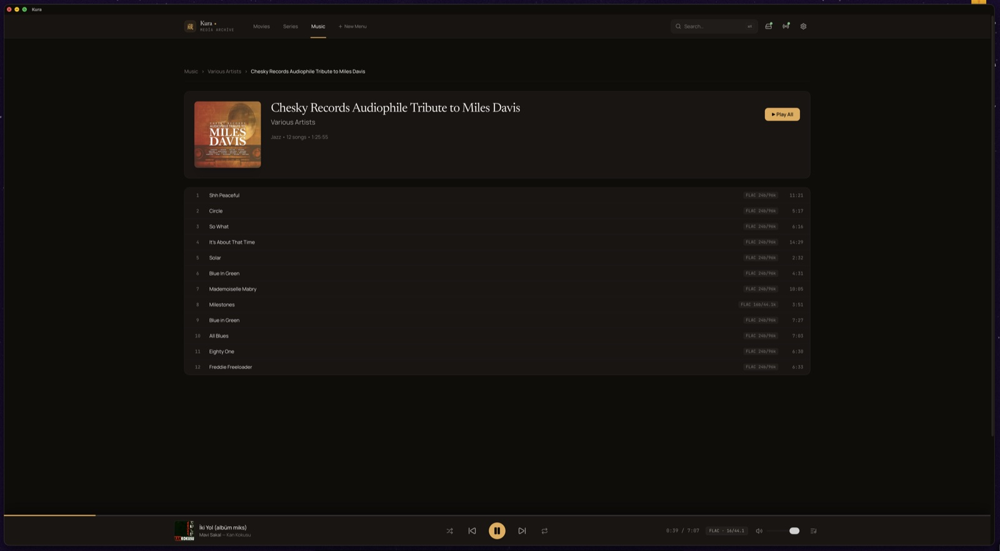
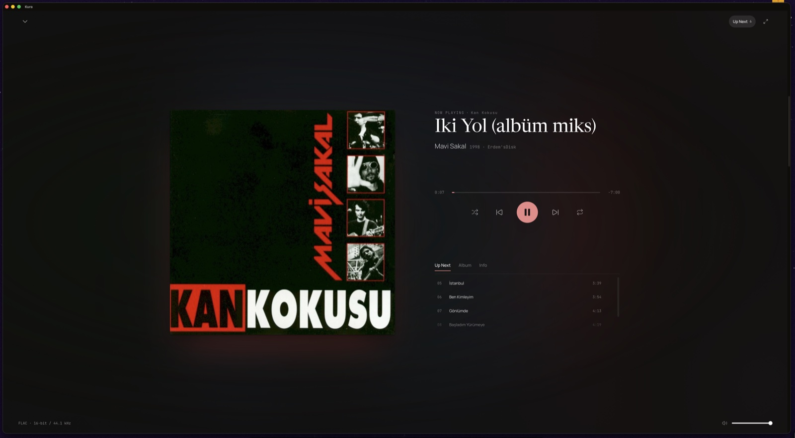

[English](README.md) | [Türkçe](README.tr.md)

<p align="center">
  
</p>

# Kura (蔵)

**Kişisel Medya Arşivi** — yerel diskleri indeksle, favori uygulamalarınla veya gömülü oynatıcıyla çal, aynı ağdaki telefondan her şeyi yönet.

**Tauri v2**, **Rust** ve **React** ile geliştirilmiştir.

## Özellikler

- **Yerel öncelikli kütüphane** — dahili/harici sürücülerdeki klasörleri tara; film, dizi ve müzik ayrı görünümlerde toplanır
- **Harici + uygulama içi oynatma** — VLC, IINA, Audirvana, foobar2000 vb. veya gömülü müzik/video oynatıcılar
- **LAN uzaktan kumanda** — aynı arayüz `http://<ip-adresin>:8080` üzerinden telefonda açılır
- **Müzik hiyerarşisi** — sanatçı → albüm → şarkı; “Tümünü Çal” playlist’leri
- **Poster ve metadata** — klasör afişi, TMDB (isteğe bağlı anahtar), iTunes ve TVmaze yedekleri
- **Last.fm scrobbling** — Kura’da dinlediklerini Last.fm profiline yansıt

## Ekran görüntüleri

<p align="center">
  
  <br /><em>Müzik kütüphanesi — albüm ızgarası</em>
</p>

<p align="center">
  
  <br /><em>Albüm detayı — şarkı listesi ve ses kalitesi rozetleri</em>
</p>

<p align="center">
  
  <br /><em>Şimdi çalıyor — tam ekran oynatıcı</em>
</p>

## Gereksinimler

- [Node.js](https://nodejs.org/) 18+
- [Rust](https://www.rust-lang.org/tools/install) (stable) + işletim sistemin için Tauri önkoşulları
- macOS (şu an birincil hedef; Apple Silicon ffmpeg sidecar `src-tauri/binaries/` altında)

## Geliştirme

```bash
npm install                 # frontend bağımlılıkları
npm run tauri dev           # masaüstü uygulaması (Vite + Rust hot-reload)
```

Uygulama açılınca Axum sunucusu `0.0.0.0:8080` üzerinde dinler ve `dist/` klasörünü ağ tarayıcılarına sunar. İlk çalıştırmada tam uzaktan arayüz için:

```bash
npm run build               # dist/ üretir (LAN sunucusu da bunu kullanır)
npm run tauri build         # release paketi
```

### Yararlı komutlar

| Komut | Açıklama |
|---|---|
| `npm run icon` | `app-icon.png` kaynağından Tauri ikon setini üretir |
| `cargo check` (`src-tauri` içinde) | Rust tip/hata kontrolü |
| `cargo clippy` (`src-tauri` içinde) | Rust lints |

İsteğe bağlı ortam değişkenleri ([`.env.example`](.env.example)):

- `LASTFM_API_KEY` / `LASTFM_SHARED_SECRET` — Last.fm entegrasyonu
- `KURA_DIST` — Axum’un sunduğu statik `dist/` yolunu geçersiz kılar

TMDB anahtarı uygulama içi Ayarlar panelinden girilir (app-data’da saklanır; `.env` zorunlu değildir).

## Kullanım

1. Kura’yı başlat.
2. Bir medya klasörü ekle (yol alanı veya **Gözat…**). Dosyalar Film / Dizi / Müzik’e ayrılır.
   - **Filmler** klasör bazında gruplanır (örn. CD1/CD2 → tek kart); eşleşen altyazılar CC rozeti gösterir.
   - **Diziler** `S01E01` / `2x05` benzeri adlardan Dizi → Sezon → Bölüm çıkarır.
   - Gizli çöp dosyalar (`._*`, `.DS_Store` vb.) indekslenmez ve temizlenir.
3. Kartı aç: poster, özet, puan; tek tek veya playlist olarak oynat.
4. Müzik: Albümler / Sanatçılar → detay → **Tümünü Çal** seçili oynatıcı için `.m3u8` üretir.
5. Telefonda `http://<bilgisayar-ip>:8080` adresini aç — aynı arayüz uzaktan kumanda olur.

## Mimari

```
+------------------------------------------------------------------+
|                         RUST ÇEKİRDEĞİ                           |
|  +------------------------+    +------------------------------+ |
|  |     Tauri IPC Core     |    |     Axum HTTP Sunucusu       | |
|  |  (Masaüstü Penceresi)  |    |  (0.0.0.0:8080 - LAN)        | |
|  +-----------+------------+    +---------------+--------------+ |
|              +---------------------+--------------------------+  |
|                                    v                             |
|  Ortak servisler: runner · scanner · db (SQLite) · covers/meta  |
+------------------------------------------------------------------+
```

- **Backend:** Tauri v2 (Rust)
- **Gömülü sunucu:** Axum, `0.0.0.0:8080`
- **Veritabanı:** app-data dizininde SQLite
- **Frontend:** React + TypeScript + Vite + Tailwind CSS v4  
  Tek `dist` derlemesi hem Tauri penceresine hem LAN tarayıcılarına sunulur.

### API referansı (LAN)

| Uç | Açıklama |
|---|---|
| `GET /api/status` | Sunucu durumu, sürüm, doğrulama gereksinimi |
| `GET /api/library?type=&q=` | Kütüphane sorgusu |
| `GET /api/disks` | Bağlı diskler |
| `POST /api/scan` | Dizini indeksle |
| `POST /api/open` | Dosyayı harici oynatıcıda aç |
| `POST /api/open-batch` | “Tümünü Çal” — `.m3u8` playlist |
| `GET /api/music/*` | Sanatçı, albüm, şarkı |
| `GET /api/movies/*` · `/api/series/*` | Film grupları ve dizi hiyerarşisi |
| `GET /api/cover` · `/api/meta` | Kapak ve metadata |

## Güvenlik

- `/api/open` yalnızca **indekste kayıtlı** dosyaları başlatabilir.
- `target_app` beyaz liste ile sınırlıdır (`system`, `VLC`, `IINA`, `Audirvana`, `foobar2000`, `QuickTime Player`, …).
- Token doğrulaması varsayılan olarak **kapalıdır**. Ayarlar’dan (⚙) aç; tarayıcı ilk girişte `X-Auth-Token` gönderir.
- Dinleme adresi LAN’a açıktır (`0.0.0.0`). Güvenilmeyen ağlarda token auth önerilir.

## Lisans

[MIT](LICENSE) © Erdem Uslu

---

[English README](README.md)
